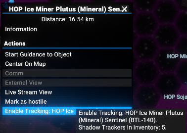
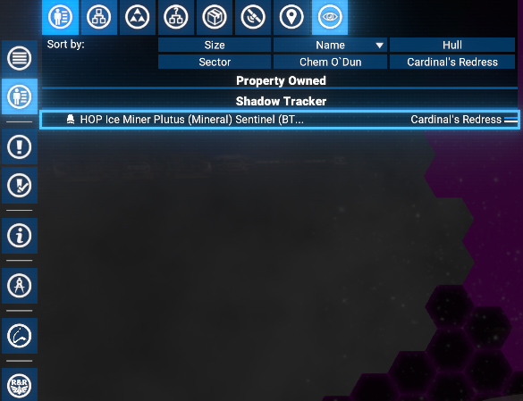
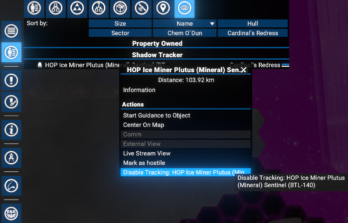
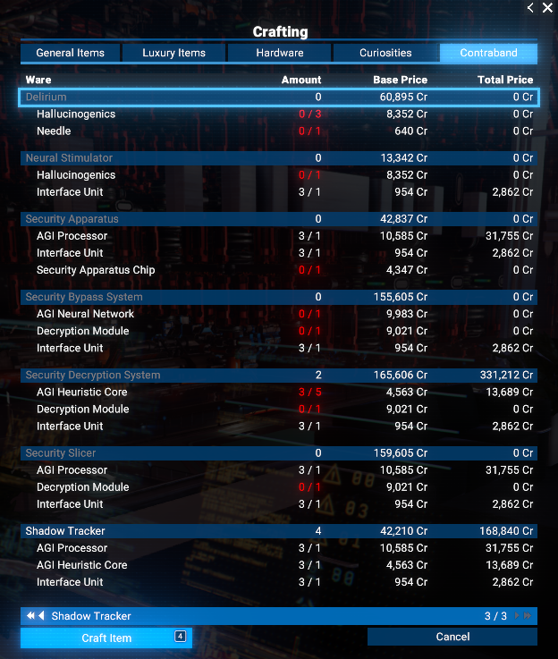
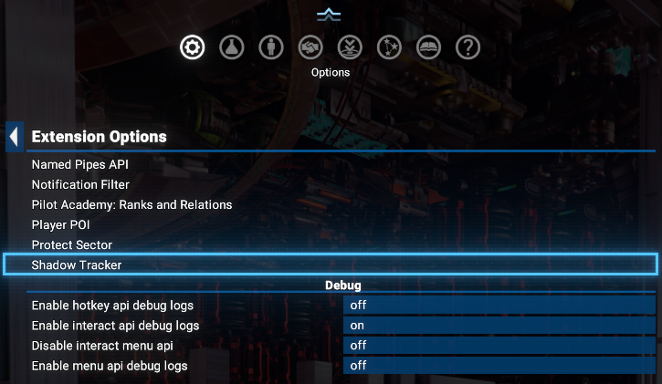
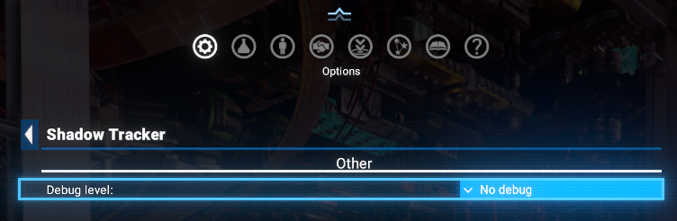

# Shadow Tracker

Implementation of the Shadow Tracker device, allowing players to track specific ships in the universe by consuming a special inventory item.

## Features

- **Ship Tracking**: Use Shadow Tracker devices to track specific ships, making their location constantly visible on the map.
- **Crafting and Inventory**: Shadow Trackers are craftable items that can be stored in the player's inventory.
- **Shadow Tracker Tab**: A dedicated tab in the UI displays all currently tracked ships.

## Requirements

- **X4: Foundations**: Version 8.00HF3, 9.00 or newer.
- **UI Extensions and HUD**: Version v8.0.4.0 or higher by [kuertee](https://next.nexusmods.com/profile/kuertee?gameId=2659).
  - Available on Nexus Mods: [UI Extensions and HUD](https://www.nexusmods.com/x4foundations/mods/552)
- **Mod Support APIs**: Version 1.95 or higher by [SirNukes](https://next.nexusmods.com/profile/sirnukes?gameId=2659).
  - Available on Steam: [SirNukes Mod Support APIs](https://steamcommunity.com/sharedfiles/filedetails/?id=2042901274)
  - Available on Nexus Mods: [Mod Support APIs](https://www.nexusmods.com/x4foundations/mods/503)
- **Options Helper**: Version 1.10 or higher by [SirNukes](https://next.nexusmods.com/profile/sirnukes?gameId=2659).
  - Available on Steam: [Options Helper](https://steamcommunity.com/sharedfiles/filedetails/?id=3715253556)
  - Available on Nexus Mods: [Options Helper](https://www.nexusmods.com/x4foundations/mods/2089)
- **Print Extension List**: Version 1.00 or higher by [Chem O`Dun](https://next.nexusmods.com/profile/ChemODun/mods?gameId=2659).
  - Available on Steam: [Print Extension List](https://steamcommunity.com/sharedfiles/filedetails/?id=3770927339)
  - Available on Nexus Mods: [Print Extension List](https://www.nexusmods.com/x4foundations/mods/2191)

## Compatibility

- Non breaks [Custom Tabs](https://www.nexusmods.com/x4foundations/mods/842) mod by [Mycu](https://www.nexusmods.com/x4foundations/users/7018859)

## Installation

- **Steam Workshop**: [Shadow Tracker](https://steamcommunity.com/sharedfiles/filedetails/?id=3676424693)
- **Nexus Mods**: [Shadow Tracker](https://www.nexusmods.com/x4foundations/mods/2000)

## Usage

Possibility to track any ship in the universe are strictly dependent on the availability of Shadow Tracker devices in the player's inventory.
After installing the mod, players will have 5 Shadow Tracker devices in their inventory, which can be used to track 5 different ships.
To make possibility to track more ships, players need to craft more Shadow Tracker devices using the `Crafting Bench`.

### Track a ship

To track a ship, open the context menu of the target ship and select the "Enable Tracking" action.

This will consume one Shadow Tracker device from the player's inventory and add the target ship to the tracking list.
The tracked ship will be now always visible on the map, allowing players to easily locate it.

### Untrack a ship

To untrack a ship, open the context menu of the tracked ship and select the "Disable Tracking" action. It is available as from the map as well as from the `Shadow Tracker` tab.

Note that after a ship is untracked, the consumed Shadow Tracker device is not returned to the player's inventory, so use this feature wisely.

### Crafting Shadow Trackers

Shadow Tracker devices can be crafted using the `Crafting Bench` station. The recipe requires the following materials:

- 1x `AGI Processor`
- 1x `AGI Heuristic Core`
- 1x `Interface Unit`

## Options

An options menu is available via the `Extension Options` menu.

There you can enable debug logging in the options menu, which will log detailed information about the mod's operations to the X4 log file. This can be helpful for troubleshooting and understanding how the mod works.

## Video

- [Video demonstration of Shadow Tracker](https://www.youtube.com/watch?v=u9j18f1Rf94)

## Credits

- **Author**: Chem O`Dun, on [Nexus Mods](https://next.nexusmods.com/profile/ChemODun/mods?gameId=2659) and [Steam Workshop](https://steamcommunity.com/id/chemodun/myworkshopfiles/?appid=392160)
- *"X4: Foundations"* is a trademark of [Egosoft](https://www.egosoft.com).

## Acknowledgements

- [EGOSOFT](https://www.egosoft.com) — for the X series.
- [kuertee](https://next.nexusmods.com/profile/kuertee?gameId=2659) — for the `UI Extensions and HUD` that makes this extension possible.
- [SirNukes](https://next.nexusmods.com/profile/sirnukes?gameId=2659) — for the `Mod Support APIs` that power the UI hooks.

## Changelog

### [8.00.03] - 2026-10-03

- **Changed**
  - Print Extension List is now required.
- **Fixed**
  - The Shadow Tracker map tab stayed empty for players who own no deployables (satellites, mines, beacons, probes).

### [8.00.02] - 2026-07-22

- **Fixed**
  - Fixed an issue where disabling tracking of captured ships was not available.

### [8.00.01] - 2026-03-01

- **Added**
  - Initial public version
